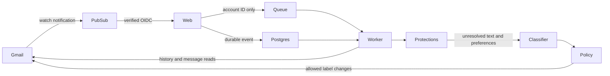

# Architecture

Sotto organizes multiple Gmail accounts in isolated workspaces. New Google identities receive separate workspaces unless the user explicitly connects another account from an existing session. Billing is optional and does not control isolation. A web process serves the interface, handles OAuth and validates authenticated Pub/Sub deliveries. Gmail synchronization and durable PostgreSQL jobs run either in a supervised worker process or in bounded Vercel Queue deliveries.

## State and concurrency

`accounts` holds encrypted credentials, per-account preferences, the Gmail cursor, watch expiration and operating mode. `mailbox_events` is the durable webhook inbox. `jobs` has a unique `(account_id,message_id)` key. `decisions` stores metadata, classification, action state and the exact label effects needed to undo. `sender_rules`, `sessions` and `oauth_states` remain separate. `workspace_identities` preserves the Google identity's workspace ownership after Gmail data deletion and records the deletion time so an older OAuth attempt cannot reconnect the account.

Deleting Gmail data requires the owning workspace's session, a valid request origin and confirmation of the account email. Under the account lock, a transaction records the deletion time and removes the account; foreign keys cascade processing history, jobs, events and sender rules. Remote watch stop and token revocation follow as best-effort operations. Gmail messages and labels are untouched. Login ownership and billing remain; deleting the entire Sotto workspace requires an operator-handled privacy request. Existing queued account IDs expire within 24 hours and cannot access a deleted connection; a fresh OAuth consent can authorize processing again.

Every worker and user action that changes account/mail state acquires the same PostgreSQL session advisory lock for that account. Keep the lock connection pinned throughout the operation. Use direct PostgreSQL or session pooling: transaction-pooling proxies are incompatible with these session locks. One account's failure does not intentionally advance another account's cursor.

History pagination uses the original start cursor on every page. Only after all pages arrive does a transaction persist deduplicated jobs, update the cursor, and mark the event batch processed. A failed later page leaves the old cursor intact. On an expired history cursor, a bounded scan starts from the account's initial scan boundary and acquires a fresh cursor before listing messages.

The baseline `start_at` is seven days before first connection. A long-lived account may need to scan a large interval after a history reset; this is correctness-oriented but not optimized for very large mailboxes yet. No such scan causes an automatic historical cleanup. A future release can add chunked backfill checkpoints.

## Decision and action boundaries

1. Fetch a message; skip sent, draft, spam, trash or non-Inbox messages.
2. Apply explicit sender/domain rules, own-organization checks and stars. Operational meaning is assessed by AI, not subject keywords.
3. Check actual SENT messages in the thread and previous outgoing correspondence, rather than trusting a `Re:` subject.
4. Classify only unresolved text with a strict schema. No tool access is given to the model.
5. Require an explicit AI `move` decision for eligible categories. Keep uncertain/protected messages. Optional categories are off by default. The model's confidence is informational, not a calibrated probability or a threshold for moving mail.
6. Record the decision. Automatic mode affects eligible messages received after activation.
7. Before moving, reread the message and current rules, verify sender authentication and policy, and persist a `moving` intent.
8. Add the destination label and remove `INBOX` on that individual message. Persist `moved`. Never remove `UNREAD`.

A crash after Gmail succeeds but before the database update is recovered by checking the persisted intent against current labels. Restore has an analogous `restoring` state. Undo adds Inbox only if Sotto removed it and removes the Sotto label only if Sotto originally added it. Already-present labels and unrelated user changes are retained. Messages moved into Spam/Trash require direct Gmail handling instead of overriding that decision.

A restored decision is terminal for that message; duplicate events cannot rearchive it. New messages in the same thread get their own jobs. A new reply is never automatically trusted to inherit an older classification.

## Failure behavior

An unavailable classifier throws; it does not fabricate a keep/move result. Jobs retry with bounded backoff and eventually show a pending-processing error. Provider response bodies and tokens are not logged. The mailbox remains untouched if classification or context reads fail. Account errors are shown alongside last-sync timestamps.

Watch renewals do not overwrite the last processed history cursor. The process worker polls every 15 minutes. Vercel mode uses incoming pushes plus a daily authenticated recovery cron, which also renews watches. Receiving webhooks alone cannot complete jobs.

In Vercel mode, Pub/Sub ingestion acknowledges only after durable database storage and awaited queue publication. Publishing failures return 503 so Pub/Sub retries. Queue payloads contain only the internal account ID. A delivery processes at most three classification jobs, then publishes a delayed continuation for pending work. Account locks prevent overlapping workers; failures propagate for queue retry. The daily recovery run also deletes expired sessions, OAuth states and processed events older than seven days.

## Known limits

- Public signup remains gated pending Google verification and hosted-service validation. The existing pilot's legacy accounts share the migrated `installation` workspace; new unlinked identities receive separate workspaces.
- No calibration claim, no guarantee of catching every cold email, and no guarantee against all model false positives.
- Gmail has no conditional label-write transaction coordinated with the user's UI. Rereads narrow, but cannot eliminate, the race with a simultaneous manual change.
- No Gmail connection/worker health certification until tested with live OAuth and delivery on the deployment.
- No automatic unsubscribe, delete, sending, attachment processing, CRM enrichment or full historical cleanup.
- Policy changes do not retroactively reclassify old decisions in this release.
- The dashboard shows up to 200 recent decisions, not complete mailbox statistics. Decision metadata is retained until the user deletes the Gmail connection's data or requests deletion through support.

## Tests

Unit and SQL-backed tests cover protections, MIME handling, crypto binding, cursor pagination, rollback, uniqueness and action recovery using synthetic data. The SQL harness uses PGlite. Actual PostgreSQL advisory locks, concurrent worker processes and provider authentication need deployment integration tests.
